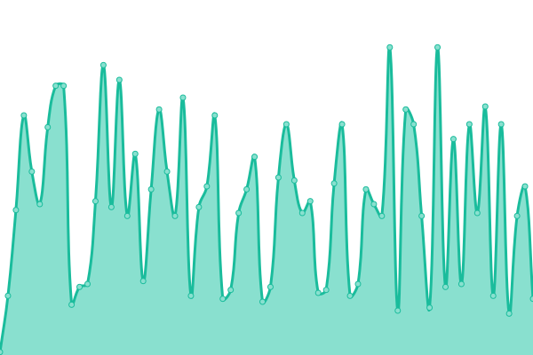
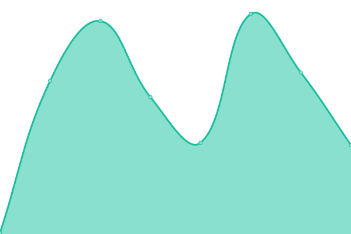

# [📈 Live Status](https://status.aerialytic.ai): <!--live status--> **🟧 Partial outage**

This repository contains the open-source uptime monitor and status page for [Aerialytic](www.aerialytic.ai), powered by [Upptime](https://github.com/upptime/upptime).

With [Upptime](https://upptime.js.org), you can get your own unlimited and free uptime monitor and status page, powered entirely by a GitHub repository. We use [Issues](https://github.com/aerialytic/status/issues) as incident reports, [Actions](https://github.com/aerialytic/status/actions) as uptime monitors, and [Pages](https://status.aerialytic.ai) for the status page.

<!--start: status pages-->
<!-- This summary is generated by Upptime (https://github.com/upptime/upptime) -->
<!-- Do not edit this manually, your changes will be overwritten -->
<!-- prettier-ignore -->
| URL | Status | History | Response Time | Uptime |
| --- | ------ | ------- | ------------- | ------ |
|  [Aerialytic AI](https://aerialytic.ai) | 🟩 Up | [aerialytic-ai.yml](https://github.com/Aerialytic/Status/commits/HEAD/history/aerialytic-ai.yml) | 

 522ms
     
 | 

<a href="https://status.aerialytic.ai/history/aerialytic-ai">100.00%</a>
    

|  [GraphQL API](https://aerialytic.ai) | 🟥 Down | [graph-ql-api.yml](https://github.com/Aerialytic/Status/commits/HEAD/history/graph-ql-api.yml) | 

 52ms
     
 | 

<a href="https://status.aerialytic.ai/history/graph-ql-api">92.62%</a>
    

|  [CRM](https://portal.aisolar.design) | 🟩 Up | [crm.yml](https://github.com/Aerialytic/Status/commits/HEAD/history/crm.yml) | 

 190ms
     
 | 

<a href="https://status.aerialytic.ai/history/crm">100.00%</a>
    

|  [IPv6 test](forwardemail.net) | 🟥 Down | [i-pv6-test.yml](https://github.com/Aerialytic/Status/commits/HEAD/history/i-pv6-test.yml) | 

 0ms
     
 | 

<a href="https://status.aerialytic.ai/history/i-pv6-test">100.00%</a>
    

<!--end: status pages-->

[**Visit our status website →**](https://status.aerialytic.ai)

## 📄 License

- Powered by: [Upptime](https://github.com/upptime/upptime)
- Code: [MIT](./LICENSE) © [Anand Chowdhary](https://anandchowdhary.com), supported by [Pabio](https://pabio.com)
- Data in the `./history` directory: [Open Database License](https://opendatacommons.org/licenses/odbl/1-0/)
